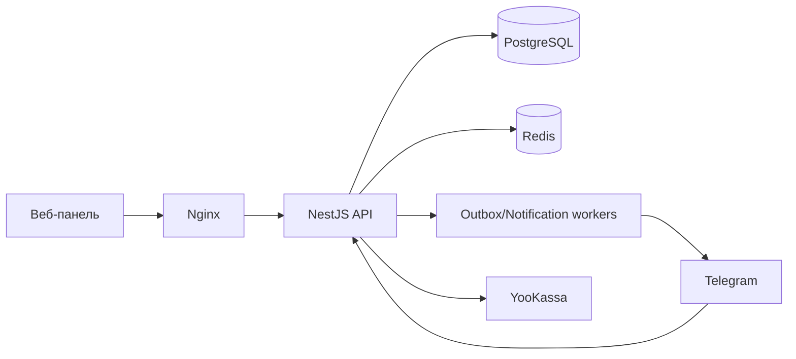

# Slotty — Telegram Business SaaS

[](https://github.com/Gregory035/telegram-business-saas/actions/workflows/ci.yml)

Slotty — SaaS для онлайн-записи через Telegram. Компания управляет услугами, сотрудниками, расписанием, клиентами, записями, уведомлениями и подпиской из веб-панели; клиент самостоятельно записывается, переносит и отменяет запись в Telegram.

## Возможности

- изоляция компаний на уровне API и составных внешних ключей PostgreSQL;
- роли `OWNER`, `ADMIN`, `EMPLOYEE` и проверка прав;
- access token только в памяти, ротация refresh-cookie и блокировка token family;
- расписание с несколькими интервалами, исключениями, буферами и DST;
- ручная и Telegram-запись, idempotency key и защита от двойного бронирования;
- клиентская база, заметки, blacklist и анонимизация;
- отзывы, лист ожидания, напоминания и повторная запись;
- dashboard, аналитика, audit log, метрики и health checks;
- Trial/Starter/Pro, YooKassa checkout/webhook и проверка статуса оплаты;
- SEO лендинга: метатеги, robots, sitemap, микроразметка и подключаемые GA4/Яндекс Метрика.

## Архитектура



Backend — modular monolith. Подробнее: [архитектура](docs/architecture.md), [изоляция компаний](docs/tenant-isolation.md), [поток записи](docs/booking-flow.md).

## Структура

- `apps/api` — NestJS, Prisma, Telegram и workers;
- `apps/web` — React/Vite;
- `apps/api/prisma/migrations` — миграции PostgreSQL;
- `scripts` — smoke/e2e, deploy и backup;
- `docs` — эксплуатационная и техническая документация;
- `.github/workflows` — CI и deployment pipeline.

## Локальный запуск

Требования: Node.js 22+, npm 10+, Docker Desktop.

```bash
cp .env.example .env
npm ci
docker compose up -d
npm run db:generate
npm run db:migrate
npm run dev
```

- Web: `http://localhost:5173`
- API: `http://localhost:3000/api`
- Swagger: `http://localhost:3000/docs` при `SWAGGER_ENABLED=true`
- Liveness: `http://localhost:3000/api/health/live`
- Readiness: `http://localhost:3000/api/health/ready`

## Проверки

```bash
npm run lint
npm run typecheck
npm test
npm run test:coverage
npm run test:integration
npm run build
npm run smoke:e2e
```

Integration-тесты используют PostgreSQL/Redis. В CI Telegram не вызывается: клиент API покрыт mock-тестами.

## Telegram webhook без VPS

1. Запустите проект.
2. Откройте HTTPS-туннель: `cloudflared tunnel --url http://localhost:3000`.
3. Запишите выданный URL в `API_PUBLIC_URL` без завершающего `/`.
4. Перезапустите API и переподключите или активируйте бота в панели.

Webhook использует secret path и проверяет `X-Telegram-Bot-Api-Secret-Token`. Токен бота хранится в AES-256-GCM зашифрованном виде.

## SEO и аналитика

Перед production-сборкой укажите домен в `WEB_URL`, `SITE_URL` и `VITE_SITE_URL`. При необходимости добавьте `VITE_GA_MEASUREMENT_ID` и `VITE_YM_COUNTER_ID`; приложение не отправляет в счётчики данные клиентов или записи. После публикации добавьте домен в Google Search Console и Яндекс Вебмастер, подтвердите права и отправьте `/sitemap.xml`.

## Production deployment

```bash
docker compose -f docker-compose.production.yml up -d postgres redis
docker compose -f docker-compose.production.yml run --rm api-migrate
docker compose -f docker-compose.production.yml up -d api web
```

Для immutable GHCR images и rollback используется `scripts/deploy.sh`; детали и обязательные переменные описаны в [docs/deployment.md](docs/deployment.md).

## Troubleshooting

- `ready = 503`: проверьте PostgreSQL/Redis и `DATABASE_URL`/`REDIS_URL`;
- бот не отвечает: проверьте `API_PUBLIC_URL`, HTTPS-туннель, статус бота и webhook secret;
- нет слотов: проверьте назначение услуги сотруднику, расписание, исключения, horizon и timezone;
- `409` при записи: слот уже занят или изменился конкурентно — запросите availability снова;
- `402`: trial/подписка истекла либо достигнут лимит тарифа.
